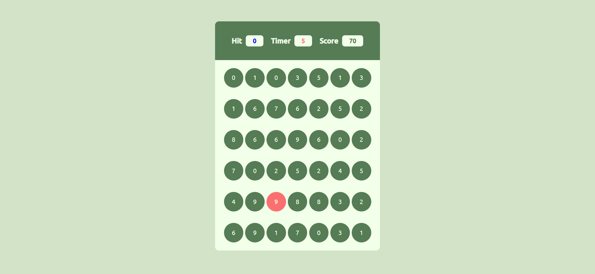
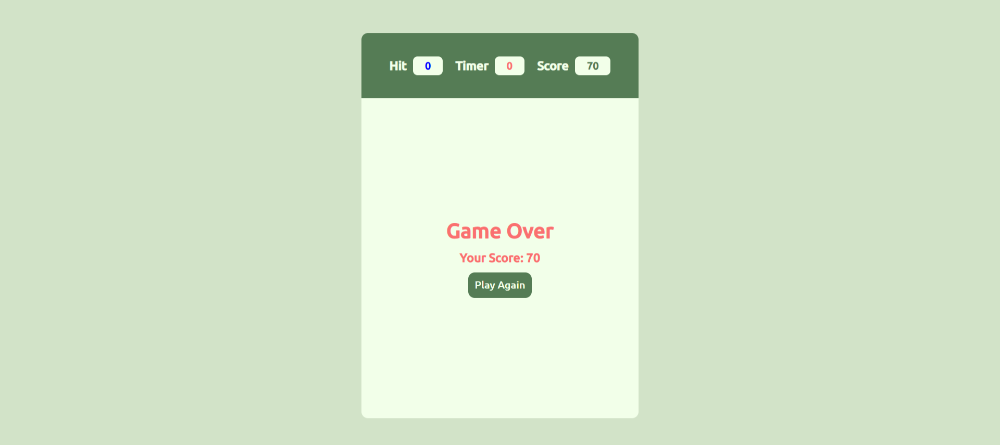

# Splash Dash

A simple web-based bubble-hitting game created using HTML, CSS, and JavaScript.

## How to Play
- Click on bubbles with the matching number to score points.
- The game has a timer, and your goal is to score as many points as possible before time runs out.

## Live Preview
[Play the game](https://afrozpawaskar.github.io/Splash-Dash/)

## Technologies Used
- HTML
- CSS
- JavaScript

## Screenshots

